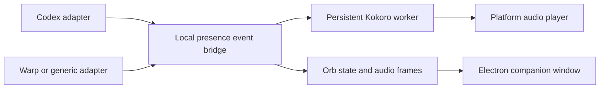
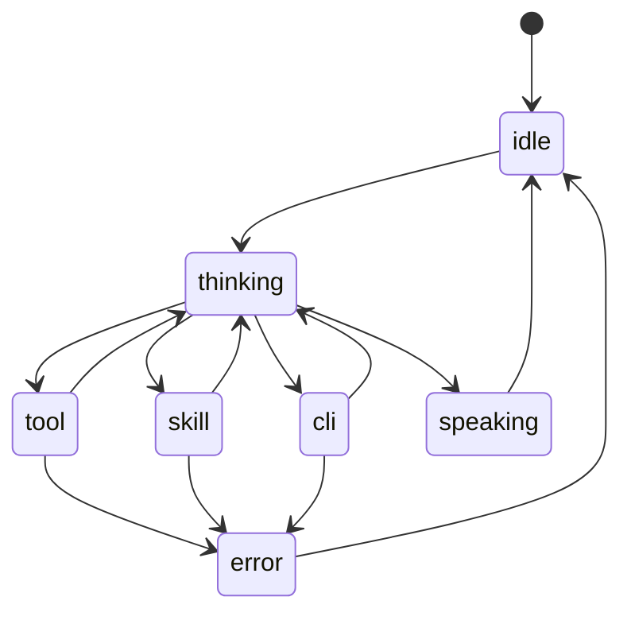

# Implementation notes

This document records the current feasibility pass for wishlist items. It is
lab material, not part of the installable skill.

## Current boundary

The existing companion is an Electron `BrowserWindow` with a transparent,
frameless, fixed 440px layout. It starts in the lower-right work area, is
non-resizable and non-movable, and ignores mouse events so it does not block
the user's editor. That click-through behavior is why dragging cannot simply
be enabled globally.

The runtime is also currently Windows-shaped in several places:

- watcher and Orb lifecycle control use PowerShell, `Start-Process`, and
  `taskkill`;
- provider readiness checks assume `Scripts/python.exe`;
- Orb start/stop is shipped as `.ps1` files;
- audio fallback uses Windows-oriented playback behavior when `ffplay` is not
  available;
- the watcher reads Codex rollout JSONL files from `~/.codex/sessions`.

The Python environment creator already has a POSIX `bin/python` branch, but
the rest of the lifecycle needs the same treatment before Linux can be called
supported.

## Proposed companion movement design

1. Keep normal mode click-through.
2. Add a project-local `orb-position.json` containing `x`, `y`, display/work
   area metadata, and a schema version.
3. Detect the deliberate `Ctrl/Cmd+Alt` plus left-button gesture from forwarded
   mouse movement, then temporarily disable mouse ignoring and enable pointer
   events in the renderer.
4. Let the renderer send drag start, delta, and drag end messages to the
   Electron main process.
5. Clamp the final position to the active display work area, persist it, and
   restore it on the next launch.
6. Add reset-position behavior for display changes or an off-screen window.

The important interaction rule is that the window must return to click-through
mode after movement. A permanently interactive transparent square would catch
clicks intended for the editor behind it.

## Proposed platform layer

Move lifecycle decisions behind small Python interfaces:

- `ProcessController`: start, stop, check, and detach a child process;
- `EnvironmentPaths`: resolve `Scripts` versus `bin` executables;
- `AudioPlayer`: choose an installed Linux, Windows, or macOS playback backend;
- `HookInstaller`: register and remove the host integration safely;
- `OrbLauncher`: invoke the platform-appropriate Electron entry point.

PowerShell and Bash files can remain as short user-facing wrappers, but the
behavior should live in Python so the cleanup, status, and failure handling do
not drift between shells.

The first Linux milestone should target CPU and optional CUDA. DirectML stays
behind the Windows provider check. Electron transparency, always-on-top
behavior, and position persistence need separate X11 and Wayland smoke tests;
the installer should report an unsupported desktop condition clearly instead
of claiming a fully working companion.

## Proposed host-adapter boundary



The bridge should accept normalized events such as:

```json
{
  "host": "codex",
  "project_root": "C:/work/project",
  "session_id": "session-id",
  "phase": "final_answer",
  "text": "Visible assistant output",
  "sequence": 12,
  "timestamp": "2026-07-11T19:00:00Z"
}
```

Codex can continue using its current Stop hook and rollout watcher while the
generic adapter accepts JSONL over stdin or a localhost IPC endpoint. The
core worker should not need to know whether the event came from Codex, Warp,
or another development environment.

## Activity-state layer

The current renderer consumes `state` events for speaking/not-speaking and
`audio` events for amplitude and frequency bands. That is enough for playback
animation, but it cannot distinguish why the assistant is currently busy.

Add a separate, deliberately coarse activity event:

```json
{
  "type": "activity",
  "state": "tool",
  "source": "host-adapter",
  "session_id": "session-id",
  "sequence": 13,
  "timestamp": "2026-07-11T19:00:01Z"
}
```

The initial state vocabulary could be:

| State | Meaning | Suggested visual direction |
| --- | --- | --- |
| `idle` | No active response | Calm baseline cyan |
| `thinking` | Model is processing | Slow violet/indigo breathing |
| `tool` | Host reports external tool activity | Amber/gold accents |
| `skill` | A named skill/integration is active | Magenta or deep violet accents |
| `cli` | Local command execution is active | Green/teal accents |
| `speaking` | Audio is being played | Current amplitude deformation |
| `waiting` | Waiting for user or host input | Dim, steady halo |
| `error` | Non-sensitive failure state | Short red pulse, then baseline |

These are categories, not transcripts. The host adapter should emit them from
explicit lifecycle records and never forward the underlying tool name,
command, arguments, paths, or hidden reasoning to the renderer.

The implemented flow is:



Implementation should keep activity state separate from audio amplitude. A
tool call can remain visually active while no audio is playing, and speech can
resume after the tool state without resetting the renderer's geometry abruptly.
Each state needs a heartbeat/expiry path and a safe fallback to `idle`.

The Orb theme work should eventually allow users to customize the state-to-
color mapping, intensity, pulse speed, and transition style without changing
the host adapter or Kokoro worker.

The current lab implementation adds `scripts/activity.py` as a small
category-only UDP bridge. The rollout watcher classifies lifecycle metadata
without reading message or tool content, aggregates selected sessions, sends
state leases with heartbeats, and expires them back to `idle`. The renderer
keeps activity separate from audio amplitude and suppresses activity tint
while speech is active. Explicit `skill`, `waiting`, and `error` states are
available to future adapters through the same bridge.

## App-server response-delta experiment

The lab now includes `scripts/app_server_bridge.py`, an experimental stdio
adapter for clients that speak the Codex app-server protocol. It launches the
local app-server as a child process, forwards client and server lines without
rewriting them, and observes only safe lifecycle fields. Visible
`item/agentMessage/delta` notifications are queued into a separate
incremental Kokoro worker; sentence-sized chunks share one `ffplay` pipe and
one Orb playback timeline, so the bridge never waits for synthesis before
forwarding protocol traffic.

The bridge was verified locally against the installed app-server: initialize,
thread start, and a no-tools turn completed through the proxy. The DirectML
runtime produced streamed audio from the deltas and the existing Orb received
the playback timeline. This remains a lab-only stdio path for a custom client;
the packaged Codex Desktop client is not automatically redirected through it.

## Representation direction

The strongest direction is presence without a literal face. Preserve the
current ring/strand/portal silhouette and give each layer a restrained job:

- inner aperture: attention, listening, and thinking;
- ring and strands: speech cadence and semantic activity;
- halo/afterglow: continuity between state transitions.

The renderer should derive speech motion from at least two signals: a smoothed
amplitude envelope and a cadence/onset signal such as spectral flux or short-
time energy changes. Volume alone makes every sentence look the same. A slow,
seeded asymmetry field can break perfect radial symmetry without introducing
random frame-to-frame noise.

Idle breathing, listening/thinking pulses, and post-speech afterglow should be
low-energy defaults. They should yield to speech and activity states rather
than compete with them. This keeps the representation expressive while
preserving the non-avatar quality that makes the Orb feel like a presence.

## First implementation slices

1. Add movable-window state and an explicit move mode on Windows.
2. Extract process and path handling from `toggle.py`, `setup.py`, and
   `configure.py` into a platform module.
3. Add Linux CPU smoke tests and Bash wrappers; then add CUDA detection.
4. Define and test the generic JSONL adapter without changing Codex behavior.
5. Add one external-host proof of concept before naming a stable adapter API.

## Acceptance checks

- Dragging works on Windows, survives an Orb restart, and does not block normal
  editor clicks outside move mode.
- Linux CPU setup works without PowerShell and can cleanly stop every child
  process it starts.
- Provider and audio failures are reported with the actual platform and
  backend selected.
- Codex session/project isolation remains intact.
- A generic adapter can drive one visible response and one progress event
  without exposing hidden reasoning or raw tool output.
- Activity transitions render the category only, expire safely, and remain
  independent of audio playback timing.
