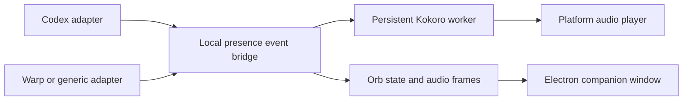

# Implementation notes

This document records the current feasibility pass for wishlist items. It is
lab material, not part of the installable skill.

## Current boundary

The existing companion is an Electron `BrowserWindow` with a transparent,
frameless, fixed 440px layout. It starts in the lower-right work area, is
non-resizable and non-movable, and ignores mouse events so it does not block
the user's editor. That click-through behavior is why dragging cannot simply
be enabled globally.

The runtime is also currently Windows-shaped in several places:

- watcher and Orb lifecycle control use PowerShell, `Start-Process`, and
  `taskkill`;
- provider readiness checks assume `Scripts/python.exe`;
- Orb start/stop is shipped as `.ps1` files;
- audio fallback uses Windows-oriented playback behavior when `ffplay` is not
  available;
- the watcher reads Codex rollout JSONL files from `~/.codex/sessions`.

The Python environment creator already has a POSIX `bin/python` branch, but
the rest of the lifecycle needs the same treatment before Linux can be called
supported.

## Proposed companion movement design

1. Keep normal mode click-through.
2. Add a project-local `orb-position.json` containing `x`, `y`, display/work
   area metadata, and a schema version.
3. Add a move-mode control that temporarily disables mouse ignoring and
   enables pointer events in the renderer.
4. Let the renderer send drag start, delta, and drag end messages to the
   Electron main process.
5. Clamp the final position to the active display work area, persist it, and
   restore it on the next launch.
6. Add reset-position behavior for display changes or an off-screen window.

The important interaction rule is that the window must return to click-through
mode after movement. A permanently interactive transparent square would catch
clicks intended for the editor behind it.

## Proposed platform layer

Move lifecycle decisions behind small Python interfaces:

- `ProcessController`: start, stop, check, and detach a child process;
- `EnvironmentPaths`: resolve `Scripts` versus `bin` executables;
- `AudioPlayer`: choose an installed Linux, Windows, or macOS playback backend;
- `HookInstaller`: register and remove the host integration safely;
- `OrbLauncher`: invoke the platform-appropriate Electron entry point.

PowerShell and Bash files can remain as short user-facing wrappers, but the
behavior should live in Python so the cleanup, status, and failure handling do
not drift between shells.

The first Linux milestone should target CPU and optional CUDA. DirectML stays
behind the Windows provider check. Electron transparency, always-on-top
behavior, and position persistence need separate X11 and Wayland smoke tests;
the installer should report an unsupported desktop condition clearly instead
of claiming a fully working companion.

## Proposed host-adapter boundary



The bridge should accept normalized events such as:

```json
{
  "host": "codex",
  "project_root": "C:/work/project",
  "session_id": "session-id",
  "phase": "final_answer",
  "text": "Visible assistant output",
  "sequence": 12,
  "timestamp": "2026-07-11T19:00:00Z"
}
```

Codex can continue using its current Stop hook and rollout watcher while the
generic adapter accepts JSONL over stdin or a localhost IPC endpoint. The
core worker should not need to know whether the event came from Codex, Warp,
or another development environment.

## First implementation slices

1. Add movable-window state and an explicit move mode on Windows.
2. Extract process and path handling from `toggle.py`, `setup.py`, and
   `configure.py` into a platform module.
3. Add Linux CPU smoke tests and Bash wrappers; then add CUDA detection.
4. Define and test the generic JSONL adapter without changing Codex behavior.
5. Add one external-host proof of concept before naming a stable adapter API.

## Acceptance checks

- Dragging works on Windows, survives an Orb restart, and does not block normal
  editor clicks outside move mode.
- Linux CPU setup works without PowerShell and can cleanly stop every child
  process it starts.
- Provider and audio failures are reported with the actual platform and
  backend selected.
- Codex session/project isolation remains intact.
- A generic adapter can drive one visible response and one progress event
  without exposing hidden reasoning or raw tool output.

