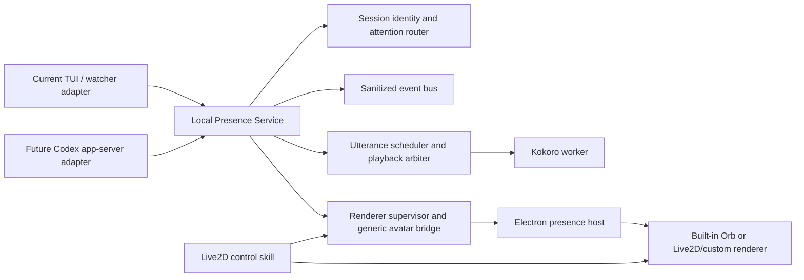

# Unified Presence Runtime and Host-Adapter Sequencing Decision

**Status:** architecture decision; Presence Service shell implemented locally
**Date:** 2026-07-13  
**Scope:** `codex-voice`, `live2d-avatar-controls`, the future local presence service, and the Codex host adapter

## Decision

Unify the local runtime/control plane first, then add a Codex app-server host
adapter.

Do not migrate both skills to a host protocol first, and do not attempt a full
service rewrite and host migration in one pass.

The external notes in `C:\Users\Bartek\Documents\Codex-AI-presence-lab.acp-pivot`
were about Agentic Commerce Protocol and are not relevant to this runtime.
Agent Client Protocol (ACP) is a separate optional editor/agent transport. It
may become a future adapter, but it is not the local Presence Service or a
guaranteed shared provider daemon. Codex app-server is another possible source
for threads, turns, approvals, and streamed events.

The skills should remain separately installable and separately owned. The
runtime they start should converge on one local Presence Service that owns
session identity, sanitized events, attention arbitration, utterance
scheduling, playback ownership, renderer selection, and lifecycle. TTS,
Electron, and a future Live2D renderer may remain separate child processes.

"Unified service" means one control plane and one state owner, not one giant
process.

## Deferred haunted issues

These are deliberately parked and must not be used as acceptance criteria for
the next architecture slice:

1. **Voice capture is still haunted.** The Ctrl+Alt/right-button capture path
   is not trusted as a reliable user interaction. Do not expand it, redesign
   its transcription flow, or use it to validate the new service yet. Keep
   microphone input opt-in and isolated until the host-adapter pivot is understood.

2. **Spoken session identity is still haunted.** Session labels were disabled
   because the previous per-message behavior was distracting, but the desired
   stateful identity event has not been implemented. The future service should
   announce or display identity on a session/foreground transition, not prepend
   a label to every utterance.

3. Messages being read out of order after attempted recording. _note the following_; the runtime correctly calls the voice input, the  **os** notices the microphone recording event being triggered, it's either the stt or send message trigger that utltimately fails. 


The existing code remains available for later investigation. This document
records the pause; it does not claim either issue is fixed.

## Why this order

The product brief defines the durable product as a local embodied-session
layer with four control layers:

- deterministic operational state;
- deterministic host/tool bindings;
- bounded output-conditioned semantic behavior;
- optional explicit task-agent actions.

It also assigns the two repositories complementary responsibilities: Voice
owns the host, speech, activity, renderer boundary, and session orchestration;
Live2D owns model import, profiles, semantic actions, compilation, and renderer
materialization.

That separation is already close to a service boundary. Codex app-server is
valuable because it can provide a better source of streaming session lifecycle
and visible output, but it does not decide who owns the inbox, playback clock,
attention policy, renderer process, or uninstall boundary. Establishing those
ownership rules first keeps the service independent of its host adapter.

The scraped ACP notes reinforce the boundary: ACP, MCP, Codex app-server, and
Voice/Live2D are different surfaces. Only Codex app-server belongs in the
future local session adapter.

## Options considered

| Option | Assessment | Decision |
| --- | --- | --- |
| Unify the service first | Lowest-risk extraction. The current watcher/TUI path remains an adapter while state ownership becomes explicit. | **Chosen first step** |
| Migrate both skills to a host protocol first | Improves host visibility, but duplicates lifecycle and arbitration decisions across two skills and blocks progress on the local product core. | Defer |
| Migrate and unify simultaneously | The broadest change: new host transport, new process owner, new lifecycle, and new tests at once. Failure diagnosis becomes ambiguous. | Reject for now |

## Target topology



The current watcher remains the first adapter. It should feed the service's
normalized events rather than owning a second playback or inbox path. The Codex
app-server adapter can later replace that input path without changing the
renderer or speech contracts.

## Ownership boundary

### Presence Service owns

- session/project identity and foreground/background state;
- event normalization and privacy filtering;
- activity state leases: idle, thinking, tool, skill, cli, waiting, and error;
- separate playback lifecycle: speaking/idle state packets and audio samples;
- attention priority and one-session-at-a-time audio arbitration;
- utterance lifecycle: planned, audio-ready, started, interrupted, finished;
- Kokoro worker supervision and playback timing;
- generic avatar-state forwarding;
- Electron renderer process lifecycle;
- durable runtime state and cleanup manifest.

### `codex-voice` skill owns

- installation and configuration of the Presence Service;
- Kokoro assets and provider environments;
- the current Codex/TUI watcher adapter;
- the built-in Orb and generic renderer host;
- the generic activity, audio, and avatar-state contracts;
- service start/stop, diagnosis, and uninstall.

During migration, these remain the same repository's source/runtime surfaces.
The service extraction should not require the user-facing skill to disappear.

### `live2d-avatar-controls` skill owns

- model import and license/source boundaries;
- model fingerprints and profile packs;
- semantic action descriptions and visually verified conflict rules;
- model-local state composition and compiled Cubism operations;
- materializing and updating a Live2D renderer bundle;
- the renderer-specific adapter that consumes generic service events.

In this lab, that runtime is a first-class source package under
`live2d-avatar-runtime/`. The package boundary is internal to this repository,
but its ownership boundary remains explicit: the runtime owns model-local
profiles, compiled operations, and materialized bundles, while `codex-voice`
continues to own the generic host and avatar-state bridge. The source package
does not include the upstream `.git` directory or user-owned model assets.

It must not own the global inbox, TTS worker, session focus, or Electron host
lifecycle. It may request or publish generic state through the managed bridge.

### Future Codex app-server adapter owns later

The Codex app-server adapter should provide session lifecycle, visible output
deltas, tool/skill activity, approvals, and turn completion to the Presence
Service. It should not become the owner of avatar profiles, local audio, or
renderer process cleanup.

ACP remains an external Agent Client Protocol transport and has no runtime
ownership here. A future ACP relay may feed the Presence Service, just like the
current watcher or a Codex app-server adapter.

## Contracts to preserve

The first service extraction should preserve these existing boundaries:

- sanitized activity events;
- speech/audio events and playback-clock semantics;
- `avatar-state/v0.1` complete action snapshots;
- avatar capabilities discovered by the Live2D runtime;
- project/session separation;
- manifest-owned runtime artifacts and uninstall boundaries.

The next identity contract should be stateful rather than text-prefix based:

```json
{
  "type": "session-identity",
  "session_id": "...",
  "project_root": "...",
  "session_label": "human-readable label",
  "revision": 3,
  "foreground": true,
  "announce": true
}
```

The service can use this event to update the renderer, choose a voice/profile,
and optionally speak one announcement on a transition. Assistant text and
session identity remain separate data; the label is never injected into the
Codex prompt or stored response.

## Implementation sequence

### Phase 0 - freeze the haunted slice

- Do not repair voice capture in this pass.
- Keep session-label behavior disabled while its stateful replacement is
  designed.
- Do not add more watcher-facing or GUI-specific behavior.
- Keep the current Live2D bridge and generic avatar-state contract unchanged.

### Phase 1 - extract a thin Presence Service shell

Create a local service boundary around the existing implementation with:

1. one service state store;
2. one event normalizer;
3. one playback/inbox owner;
4. one renderer supervisor;
5. one adapter interface for Codex events.

Initially, the adapter is the existing watcher. The service should be able to
run the current Orb and Live2D renderer without changing their event payloads.

The local shell now has a user-level global playback arbiter: project-local
watchers own rollout cursors and adapter inboxes, while the arbiter owns the
cross-project serialized attention queue, session-transition announcements, completion
delivery, and exactly one warm Kokoro worker. Renderer supervision and the
future app-server adapter remain separate concerns; they must connect to this
arbiter rather than create another worker.

### Phase 2 - add the Codex app-server adapter beside the current adapter

Add the Codex app-server adapter as a second adapter feeding the same normalized
events. Run both only in diagnostic or controlled E2E modes until event
duplication and ownership are proven absent. The service remains the
deduplication and attention authority.

### Phase 3 - move streaming and identity onto the service

Use Codex app-server visible output deltas to drive phrase segmentation and
utterance scheduling. Add stateful identity transitions and session foreground
routing.
Only then revisit voice input, because its target selection and focus lock can
use the service's authoritative session registry rather than guessing from the
currently playing message.

### Phase 4 - retire redundant adapters and promote

After a two-session E2E run passes, make the Codex app-server adapter preferred where
available and keep the current watcher as a compatibility fallback. Update the
runtime manifest, install/uninstall paths, and release gate together.

## First milestone acceptance criteria

The next implementation slice is complete only when:

- current watcher input can feed the unified service without behavior changes;
- the built-in Orb and Live2D renderer receive the same sanitized events;
- exactly one component owns playback and inbox draining;
- two sessions retain distinct identity and priority;
- no hidden reasoning, raw tool arguments, paths, secrets, or model controls
  cross the renderer boundary;
- service restart recovers stale state deterministically;
- both skills can be installed or removed without deleting the other's
  user-owned resources;
- the service has an adapter seam ready for Codex app-server, but that adapter is not required for
  the first local smoke.

## Explicit non-goals

- fixing microphone capture now;
- restoring automatic spoken session labels now;
- replacing the current generic avatar-state envelope;
- merging the two installable skills into one user-facing skill;
- putting Live2D model parsing into the Voice service;
- building a broad plugin marketplace or behavior model;
- implementing a host adapter and the service extraction as one untestable rewrite.

## Decision summary

Keep the skills separate. Unify their runtime ownership behind a thin local
Presence Service. Preserve the current watcher as an adapter. Repair the
current voice-input, inbox, identity, and lifecycle behavior before adding host
adapters. Add Codex app-server and optional ACP relays to that service later;
ACP is an ingress transport, not the runtime core.
